# GAIA Agent

AI agent for the [GAIA benchmark](https://huggingface.co/gaia-benchmark) using [Hugging Face Inference API](https://huggingface.co/inference-api) with multi-tool capabilities including web search, file processing, and mathematical calculations.

## Features

- Answer GAIA benchmark questions using Hugging Face Inference API
- Web search integration via [Tavily API](https://tavily.com/)
- File reading and processing (Excel, CSV, text files)
- Mathematical calculations
- [Gradio](https://gradio.app/) web interface for testing and submission generation
- Detailed reasoning traces for transparency
- JSONL submission file generation

## Tech Stack

- **[Python](https://www.python.org/) 3.8+**
- **[Hugging Face Inference API](https://huggingface.co/inference-api)** - LLM inference (Kimi-K2, Llama 3.1, Qwen 2.5)
- **[Gradio](https://gradio.app/)** - Web interface
- **[Tavily](https://tavily.com/)** - Web search
- **[Pandas](https://pandas.pydata.org/)** - Data processing
- **[Requests](https://requests.readthedocs.io/)** - HTTP client

## Architecture

The system follows a modular architecture with clear separation between presentation, orchestration, and service layers.

```mermaid
flowchart LR
    %% Client Layer
    UI["🖥️ Gradio Interface<br/><small>app.py</small>"]

    %% Orchestration Layer
    Agent["🤖 GAIA Agent<br/><small>agent.py</small>"]
    Client["📡 API Client<br/><small>gaia_client.py</small>"]

    %% Tool Layer
    Search["🔍 Web Search<br/><small>Tavily</small>"]
    FileReader["📄 File Reader<br/><small>Excel/CSV/Text</small>"]
    Calculator["🧮 Calculator<br/><small>Math Eval</small>"]

    %% External Services
    HF["⚡ HF Inference API<br/><small>Kimi-K2</small>"]
    GAIA["🎯 GAIA Benchmark<br/><small>Questions & Eval</small>"]
    Tavily["🌐 Tavily API<br/><small>Search Engine</small>"]

    %% Primary Flow
    UI -->|"1. User Query"| Agent
    Agent -->|"2. LLM Request"| HF
    HF -->|"3. Response"| Agent
    Agent -->|"4. Answer"| UI

    %% Tool Orchestration
    Agent -.->|"invoke"| Search
    Agent -.->|"invoke"| FileReader
    Agent -.->|"invoke"| Calculator

    %% Tool-Service Connections
    Search -->|"query"| Tavily
    Tavily -->|"results"| Search

    FileReader -->|"download"| GAIA
    GAIA -->|"file data"| FileReader

    %% API Client Flow
    UI -->|"fetch/submit"| Client
    Client <-->|"HTTP"| GAIA

    %% Styling
    classDef clientStyle fill:#e3f2fd,stroke:#1976d2,stroke-width:3px,color:#000
    classDef orchestrationStyle fill:#fff3e0,stroke:#f57c00,stroke-width:3px,color:#000
    classDef toolStyle fill:#e8f5e9,stroke:#388e3c,stroke-width:2px,color:#000
    classDef externalStyle fill:#f3e5f5,stroke:#7b1fa2,stroke-width:2px,color:#000

    class UI clientStyle
    class Agent,Client orchestrationStyle
    class Search,FileReader,Calculator toolStyle
    class HF,GAIA,Tavily externalStyle
```



### Component Overview

#### Client Layer

- [Gradio](https://gradio.app/) interface for user interaction, testing, and submission generation
- Handles UI rendering, form inputs, and file downloads

#### Orchestration Layer

- **GAIA Agent** ([`agent.py`](agent.py)): Core reasoning engine that coordinates tool usage and generates answers
- **GAIA API Client** ([`gaia_client.py`](gaia_client.py)): Manages communication with the GAIA benchmark API

#### Tool Layer

- **Web Search** ([`tools.py`](tools.py)): Tavily-powered search for real-time information retrieval
- **File Reader** ([`tools.py`](tools.py)): Downloads and processes files (Excel, CSV, text) from GAIA API
- **Calculator** ([`tools.py`](tools.py)): Safe mathematical expression evaluation

#### External Services

- **[Hugging Face Inference API](https://huggingface.co/inference-api)**: LLM inference using Kimi-K2 or Llama models
- **[GAIA Benchmark API](https://huggingface.co/gaia-benchmark)**: Question retrieval and answer submission
- **[Tavily Search API](https://tavily.com/)**: Web search capabilities

#### Data Flow

1. User submits query via Gradio interface
2. Agent analyzes question and determines required tools
3. Tools fetch external data (web search, files)
4. Agent sends context to HF Inference API
5. LLM generates reasoning and answer
6. Response returned to user with full reasoning trace

## Prerequisites

- [Python](https://www.python.org/) 3.8 or higher
- pip package manager
- [Hugging Face API token](https://huggingface.co/settings/tokens)
- [Tavily API key](https://tavily.com/)
- GAIA API access

## Installation

### 1. Clone Repository

```bash
git clone https://github.com/hasancoded/gaia-agent.git
cd gaia-agent
```

### 2. Create Virtual Environment

```bash
python -m venv venv

# Windows
venv\Scripts\activate

# macOS/Linux
source venv/bin/activate
```

### 3. Install Dependencies

```bash
pip install -r requirements.txt
```

### 4. Configure Environment

```bash
cp .env.example .env
```

Edit [`.env`](.env) and add your API credentials:

```bash
HF_API_TOKEN=your_huggingface_token
TAVILY_API_KEY=your_tavily_key
GAIA_API_URL=https://agents-course-unit4-scoring.hf.space
```

**Get API Keys:**

- **HF_API_TOKEN**: [Hugging Face Settings](https://huggingface.co/settings/tokens)
- **TAVILY_API_KEY**: [Tavily Dashboard](https://tavily.com/)

## Usage

### Start Application

```bash
python app.py
```

Access the interface at `http://localhost:7860`

### Test Agent

1. Navigate to the Test Agent tab
2. Click "Test on Random Question"
3. Review answer and reasoning trace

### Generate Submission

1. Navigate to the Generate Submission tab
2. Click "Generate Submission File"
3. Download the generated `.jsonl` file
4. Submit to [GAIA Leaderboard](https://huggingface.co/spaces/gaia-benchmark/leaderboard)

## Project Structure

```
gaia-agent/
├── agent.py            # Core GAIA agent implementation
├── app.py              # Gradio web interface
├── gaia_client.py      # GAIA API client
├── tools.py            # Agent tools (search, file reader, calculator)
├── requirements.txt    # Python dependencies
├── .env.example        # Environment template
├── .gitignore          # Git ignore rules
├── LICENSE             # MIT License
└── README.md           # This file
```

## API Reference

### GAIAAgent

Main agent class for answering GAIA benchmark questions.

```python
from agent import GAIAAgent

agent = GAIAAgent(tools={
    "search": search_tool,
    "file_reader": file_reader_tool,
    "calculator": calculator_tool
})

answer, reasoning = agent.answer_question(question_text, task_id)
```

### Tools

**WebSearchTool**: Tavily-powered web search

```python
from tools import WebSearchTool
search_tool = WebSearchTool(api_key=tavily_key)
results = search_tool.search(query)
```

**FileReaderTool**: Download and process files

```python
from tools import FileReaderTool
file_tool = FileReaderTool(api_url=gaia_url)
content = file_tool.read_file(task_id)
```

**CalculatorTool**: Safe mathematical calculations

```python
from tools import CalculatorTool
calc_tool = CalculatorTool()
result = calc_tool.calculate(expression)
```

## Configuration

### Environment Variables

| Variable         | Required | Description            | Get It                                              |
| ---------------- | -------- | ---------------------- | --------------------------------------------------- |
| `HF_API_TOKEN`   | Yes      | Hugging Face API token | [Get Token](https://huggingface.co/settings/tokens) |
| `TAVILY_API_KEY` | Yes      | Tavily search API key  | [Get Key](https://tavily.com/)                      |
| `GAIA_API_URL`   | Yes      | GAIA benchmark API URL | Provided by organizers                              |

### Model Selection

Edit [`agent.py`](agent.py) to change the HF model:

```python
# Available models:
# - moonshotai/Kimi-K2-Instruct-0905 (excellent reasoning)
# - meta-llama/Llama-3.1-70B-Instruct (fastest)
# - Qwen/Qwen2.5-72B-Instruct (complex tasks)
# - meta-llama/Llama-3.1-8B-Instruct (balanced)

self.model_name = "moonshotai/Kimi-K2-Instruct-0905"
```

## Troubleshooting

### API Token Not Found

Ensure [`.env`](.env) file exists and contains valid tokens. Restart the application after editing `.env`.

### Module Import Errors

Verify virtual environment is activated and dependencies are installed:

```bash
pip install -r requirements.txt
```

### Connection Errors

Check internet connection and verify API URLs are accessible.

## Contributing

Contributions are welcome. Please follow these guidelines:

1. Fork the repository
2. Create a feature branch
3. Make your changes
4. Submit a pull request

## License

This project is licensed under the MIT License - see the [LICENSE](LICENSE) file for details.

## Acknowledgments

- [GAIA Benchmark](https://huggingface.co/gaia-benchmark) team
- [Hugging Face](https://huggingface.co/) for Inference API
- [Tavily](https://tavily.com/) for web search
- [Gradio](https://gradio.app/) for web interface

## Support

For issues related to:

- **GAIA Benchmark**: Contact GAIA organizers
- **Hugging Face API**: Check [HF documentation](https://huggingface.co/docs)
- **Tavily API**: Visit [Tavily docs](https://docs.tavily.com/)
